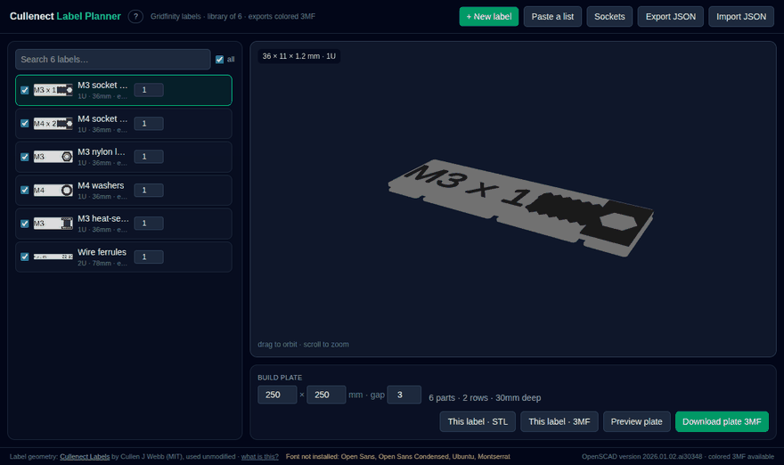
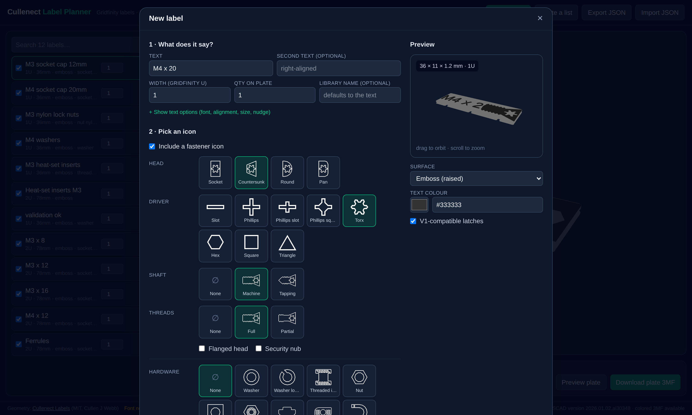
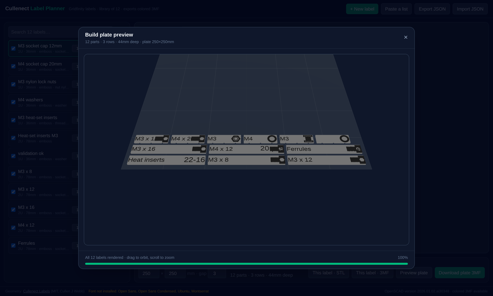

# Cullenect Label Planner

A web planner for [Cullenect labels](https://github.com/CullenJWebb/Cullenect-Labels) — the
swappable, click-in label system for Gridfinity bins. Keep a **library** of the labels you
actually use, pick icons **by looking at them**, and export **colored 3MF** for one label or a
whole packed build plate.

> Not affiliated with the Cullenect Labels project — just a tool for it. All label and socket
> geometry is that project's work, vendored here verbatim and unmodified.



*Paste a list, pick the icon by looking at it, preview the packed plate.*

## Why

The upstream OpenSCAD customizer is complete and correct, but adding a label means picking from
dropdowns of names — is `roundh` the one you want? what does `tnut_1` look like? — and you find
out after rendering. And the labels you print are a *list* you maintain over time, not a series
of one-offs.

So this app does three things the customizer doesn't:

- **keeps the list** — a persistent library you edit, reorder, search, export and re-import
- **shows you the icons** — every option as a thumbnail of its real geometry
- **builds plates** — many labels packed onto one plate, in one file

## What it does

**Pick icons by looking at them.** Every fastener and hardware option is a thumbnail rendered
from the *actual* vendored geometry, so what you click is what prints — they can't drift apart.
A row per property: head, driver, shaft, threads, hardware.



**Paste a list.** One label per line — `|` or a tab adds second text, so a two-column
spreadsheet paste works. Shared settings are chosen once and applied to the batch.

**Live 3D preview.** The server renders the real geometry and the browser displays *that exact
3MF*, colors included. The preview is the file, not a re-implementation of it.

**Build plates with a preview.** Tick labels, set copies, and see the packed plate before you
download it — real geometry at the exact positions the export uses, with per-item progress
while it renders.



**Colored 3MF.** Text and icons land in their own color group, so a slicer can assign a second
filament or a color swap with no manual painting. STL too, for single-colour printing.

**Socket accessories.** The upstream socket test-fit and negative-volume models, for cutting
Cullenect slots into bins of your own design.

## Run it

One command, nothing to install but Docker:

```bash
docker run -p 8080:80 -v cullenect-data:/data ghcr.io/dwfinkelstein/cullenect-label-planner:latest
```

Then open <http://localhost:8080>. The image carries its own renderer and fonts, so there's
nothing else to set up. Your labels live in the `cullenect-data` volume and survive upgrades —
and **Export JSON** in the app gives you a file you can keep or move to another machine.

From a clone instead:

```bash
docker compose up --build     # http://localhost:8080
```

## How it works

| | |
|---|---|
| UI | React 19 + Vite + TypeScript + Tailwind 4, three.js |
| API | FastAPI (Python 3.12) |
| Geometry | **OpenSCAD 2026.01 nightly**, Manifold backend, driving the vendored `Cullenect.scad` |
| State | a JSON file on a Docker volume |

Three things are worth knowing if you hack on it:

**It needs a 2025+ OpenSCAD.** Colored 3MF export (`-O export-3mf/color-mode`) doesn't exist in
the 2021.01 that Debian stable ships, and the Manifold backend renders a label in ~0.5s where
the old CGAL backend takes ~2 minutes — which is the difference between a live preview and a
batch queue. The image downloads a pinned AppImage and *extracts* it, because running an
AppImage normally needs FUSE and a container has none.

**Icons are 2D projections, not pictures.** Each icon module is projected to SVG. That needs no
GL context (a headless container can't provide one), renders in ~40ms, and is a few hundred
bytes — so a full picker grid is cheap and stays crisp at any size.

**Plates are merged, not re-rendered.** OpenSCAD can only render one parameter set per
invocation, since customizer values are file-level globals. So each distinct label is rendered
once and the plate is assembled by merging the 3MFs — one object per distinct label, one item
transform per copy, colors preserved.

### Fonts

`Cullenect.scad` offers Open Sans, Open Sans Condensed, Ubuntu and Montserrat, and the image
installs all four. OpenSCAD **silently substitutes** a missing family, which would quietly
change a printed label, so `/api/meta` reports any that `fc-match` can't resolve and the UI
shows a warning.

## Development

```bash
# backend — needs an OpenSCAD nightly on the host
cd backend
pip install -r requirements.txt
OPENSCAD_BIN=/path/to/OpenSCAD.AppImage DATA_DIR=/tmp/cullenect \
  RENDER_CACHE=/tmp/cullenect/cache uvicorn app.main:app --port 8000

# frontend — proxies /api to :8000
cd app && npm install && npm run dev

# tests
cd backend && python -m pytest tests -q
```

## API

| Method | Path | Purpose |
|---|---|---|
| GET/POST | `/api/labels` | list / create |
| PUT/DELETE | `/api/labels/{id}` | update / remove |
| POST | `/api/labels/bulk` | create a batch from pasted text |
| POST | `/api/labels/reorder` | persist list order |
| POST | `/api/render/preview` | render an unsaved label → 3MF |
| GET | `/api/labels/{id}/download?fmt=3mf\|stl` | single-label export |
| POST | `/api/plate` · `/api/plate/estimate` | packed plate → 3MF · layout only |
| GET | `/api/icons/{head,driver,fastener,hardware}.svg` | picker thumbnails |
| GET | `/api/accessories/{kind}` | socket test-fit / negative volume |
| GET/POST | `/api/library/export` · `/api/library/import` | JSON round-trip |
| GET | `/api/meta` · `/api/health` | options · renderer and font status |

Renders are content-addressed and cached, so an unchanged label never re-renders.

## Contributing

Issues and pull requests are welcome — see [CONTRIBUTING.md](CONTRIBUTING.md).

## Credits

Label geometry, the socket standard, and the OpenSCAD source are
[**Cullenect Labels**](https://github.com/CullenJWebb/Cullenect-Labels) by **Cullen J Webb**
(MIT), vendored here unmodified. This app only drives it. See [NOTICE](NOTICE) for full
attribution.

Related and worth knowing about:
[gflabel](https://github.com/ndevenish/gflabel) (Python label generator) and
[Gridfinity Extended](https://github.com/ostat/gridfinity_extended_openscad) (bins with
Cullenect slots built in).

This project is MIT licensed — see [LICENSE](LICENSE).
